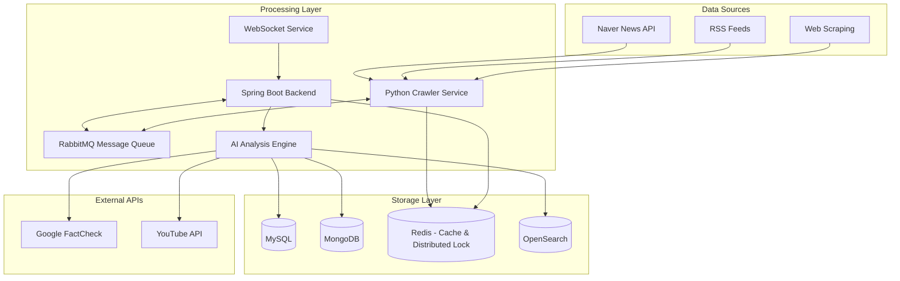

<div align="center">

# 🏭 Factory BE
### AI-Powered News Analysis Platform

[](https://openjdk.org/projects/jdk/17/)
[](https://spring.io/projects/spring-boot)
[](https://www.docker.com/)
[](https://opensearch.org/)
[](LICENSE)

[](https://github.com/your-org/factory-be/actions)
[](https://codecov.io/gh/your-org/factory-be)
[](https://github.com/your-org/factory-be/issues)
[](https://github.com/your-org/factory-be/graphs/contributors)

</div>

---

## 🎯 Overview

**Factory BE**는 실시간 뉴스 수집, AI 기반 편향성 분석, 그리고 고도화된 검색 시스템을 제공하는 차세대 뉴스 분석 플랫폼입니다. 머신러닝과 자연어 처리 기술을 활용하여 뉴스의 편향성을 객관적으로 분석하고, 사용자에게 균형잡힌 정보를 제공합니다.

<details>
<summary><strong>🔍 핵심 기능 미리보기</strong></summary>

- **🤖 AI 편향성 분석**: 보수/진보/중립 성향 자동 분류
- **📊 실시간 데이터 처리**: 대용량 뉴스 데이터 스트리밍 처리
- **🔍 고급 검색**: OpenSearch 기반 한국어 형태소 분석
- **🌐 멀티소스 크롤링**: 네이버, RSS, 동적 웹페이지 수집
- **📈 시각화 대시보드**: 편향성 트렌드 및 키워드 분석

</details>

## 🚀 Quick Start

<table>
<tr>
<td>

**🏃‍♂️ Get Started in 30 seconds**

```bash
# Clone & Start
git clone https://github.com/your-org/factory-be.git
cd factory-be

# Launch with Docker
./scripts/dev-docker.sh start

# Run Application
./scripts/dev-app.sh run
```

</td>
<td>

**✅ Health Check**

```bash
# Check Services
./scripts/dev-docker.sh health

# Verify API
curl http://localhost:8080/actuator/health
```

</td>
</tr>
</table>

> **⚡ Prerequisites**: Java 17+, Docker, Docker Compose

## 🏗️ Architecture

<div align="center">



</div>

## 🛠️ Tech Stack

<div align="center">

### Core Framework
[](https://spring.io/projects/spring-boot)
[](https://spring.io/projects/spring-security)
[](https://spring.io/projects/spring-data-jpa)
[](https://openjdk.org/)
[](https://www.python.org/)

### Data & Search
[](https://www.mysql.com/)
[](https://www.mongodb.com/)
[](https://redis.io/)
[](https://opensearch.org/)
[](https://www.rabbitmq.com/)

### AI & External APIs
[](https://developers.google.com/fact-check/)
[](https://developers.naver.com/)
[](https://playwright.dev/)
[](https://docs.python.org/3/library/asyncio.html)
[](https://github.com/konlpy/konlpy)

### DevOps & Infrastructure
[](https://www.docker.com/)
[](https://github.com/features/actions)
[](https://gradle.org/)
[](https://junit.org/junit5/)

</div>

## 📊 Key Features

<table>
<tr>
<th width="33%">🤖 AI Analysis</th>
<th width="33%">📡 Real-time Processing</th>
<th width="33%">🔍 Advanced Search</th>
</tr>
<tr>
<td>

**Bias Detection**
- 보수/진보/중립 자동 분류
- 감정 분석 (긍정/부정/중립)
- 키워드 추출 (TF-IDF)
- Google FactCheck 연동

</td>
<td>

**Live Data Pipeline**
- Java-Python 하이브리드 크롤링
- RabbitMQ 고도화된 메시지 큐 통신
- Dead Letter Queue & 자동 재시도
- Redis 분산 락 동시성 제어
- WebSocket 진행상황 추적
- 실시간 스트리밍 데이터 처리
- 자동 카테고리 분류

</td>
<td>

**Smart Search**
- 한국어 형태소 분석
- 다중 필터 검색
- 자동완성 & 추천
- 실시간 인덱싱

</td>
</tr>
</table>

### 🎨 Data Flow

```python
# AI Analysis Pipeline
def analyze_news(article):
    # 1. Content Processing
    content = preprocess_korean_text(article.content)
    
    # 2. Bias Analysis
    bias = BiasAnalyzer().predict(content)
    
    # 3. Keyword Extraction
    keywords = TFIDFExtractor().extract(content)
    
    # 4. Sentiment Analysis
    sentiment = SentimentAnalyzer().analyze(content)
    
    # 5. Fact Checking
    facts = GoogleFactChecker().verify(keywords)
    
    return AnalysisResult(bias, keywords, sentiment, facts)
```

## 📚 Documentation

<div align="center">

| 📖 Guide | 🎯 Purpose | 🔗 Link |
|----------|------------|---------|
| **🐍 Python Crawler** | Python 크롤러 완전 가이드 | [Python Crawler](python_crawler_advanced/README.md) |
| **🔥 하이브리드 시스템** | Java-Python 통합 아키텍처 | [Hybrid System Guide](docs/HYBRID_SYSTEM_GUIDE.md) |
| **🚀 Quick Start** | Docker 환경 설정 | [Docker Setup](docs/DOCKER_SETUP.md) |
| **🔧 Development** | 로컬 개발 가이드 | [Development Scripts](scripts/README.md) |
| **📡 API Reference** | REST API 완전 문서 | [REST API Docs](docs/rest-api.md) |
| **🏗️ Architecture** | 시스템 설계 개요 | [API Architecture](docs/API_OVERVIEW.md) |
| **🗄️ Database** | 스키마 및 관계 | [Database Schema](docs/schema.md) |
| **🧪 Testing** | 테스트 전략 | [Testing Guide](docs/testing/) |
| **🚀 Deployment** | CI/CD 및 배포 | [GitHub Actions](docs/GITHUB_ACTIONS_SETUP.md) |

</div>

### 💡 FAQ

<details>
<summary><strong>❓ How do I start the development environment?</strong></summary>

```bash
# Start all services
./scripts/dev-docker.sh start

# Check health
./scripts/dev-docker.sh health

# Run the application
./scripts/dev-app.sh run
```

</details>

<details>
<summary><strong>❓ How does the AI bias analysis work?</strong></summary>

Our AI system analyzes Korean news articles using:
- **Natural Language Processing**: Korean morphological analysis
- **Machine Learning Models**: Trained on labeled political bias data
- **Feature Engineering**: TF-IDF, sentiment indicators, political keywords
- **Validation**: Cross-reference with Google FactCheck API

See [API Architecture](docs/API_OVERVIEW.md) for technical details.

</details>

<details>
<summary><strong>❓ What data sources are supported?</strong></summary>

- **Naver News API**: Real-time Korean news
- **RSS Feeds**: Multiple media outlets
- **Web Scraping**: Dynamic content via Playwright
- **Manual Input**: URL-based analysis

</details>

## 🔧 Development

### Environment Setup

<table>
<tr>
<td width="50%">

**🐳 Docker Environment**

```bash
# Start all infrastructure (including RabbitMQ)
docker-compose -f docker-compose.dev.yml up -d

# Individual services
docker-compose -f docker-compose.dev.yml up -d mysql
docker-compose -f docker-compose.dev.yml restart opensearch
docker-compose -f docker-compose.dev.yml logs mongodb
docker-compose -f docker-compose.dev.yml logs rabbitmq

# Database connections
./scripts/dev-docker.sh connect mysql
```

</td>
<td width="50%">

**🚀 Hybrid System Management**

```bash
# Java Backend
./gradlew bootRun --args='--spring.profiles.active=dev'

# Python Crawler Worker
cd python_crawler_advanced
python enhanced_crawler_worker.py

# Testing
./gradlew test                           # Java tests
python test_crawler_integration.py      # Python tests

# Build
./gradlew build                          # Java build
docker build -t factory-be .             # Docker build
```

</td>
</tr>
</table>

### Project Structure

```
📁 Factory BE
├── 🌟 src/main/java/com/commonground/be/
│   ├── 🏛️ domain/                 # Business Logic Layer
│   │   ├── 🔐 auth/               # Authentication & JWT
│   │   ├── 📰 news/               # News Domain (SOLID 원칙 준수)
│   │   │   ├── exception/         # Exception Handling (CommonException 기반)
│   │   │   ├── service/
│   │   │   │   ├── crawling/      # Java 크롤링 서비스 계층
│   │   │   │   │   ├── CrawlingService.java      # 크롤링 인터페이스
│   │   │   │   │   ├── CrawlingOrchestrator.java # 크롤링 전략 조율
│   │   │   │   │   ├── CrawlingQueueService.java # RabbitMQ 큐 서비스
│   │   │   │   │   └── naver/                    # 네이버 전용 구현체
│   │   │   │   │       └── NaverNewsCrawler.java # Java 크롤러 (Redis Lock)
│   │   │   │   ├── NewsManagementService.java    # 뉴스 CRUD + 캐시 관리
│   │   │   │   ├── NewsQueryService.java         # 뉴스 조회/검색 + 통계
│   │   │   │   ├── NewsCollectionService.java    # 뉴스 수집 총괄
│   │   │   │   ├── NewsDataProcessingService.java # 데이터 변환/처리
│   │   │   │   └── NewsServiceImpl.java          # 기존 인터페이스 (위임)
│   │   │   ├── controller/
│   │   │   ├── dto/
│   │   │   ├── entity/
│   │   │   ├── enums/
│   │   │   └── repository/
│   │   ├── 👥 social/             # Social Login (Kakao, Google)
│   │   └── 👤 user/               # User Management
│   └── 🌐 global/                 # Infrastructure Layer
│       ├── 📡 application/        # API Response & Exception Handling
│       ├── 📦 domain/             # Shared Domain Objects
│       └── ⚙️ infrastructure/     # Database, Security, Encryption
│           ├── concurrency/       # Redis 분산 락 (@RedisLock)
│           └── config/            # RabbitMQ, Redis, MongoDB 설정
├── 🐍 python_crawler_advanced/    # Python 크롤러 서비스
│   ├── naver_crawler_complete.py  # Java 1:1 완전 포팅 크롤러
│   ├── redis_distributed_lock.py  # Python Redis 분산 락
│   ├── enhanced_crawler_worker.py # RabbitMQ 워커 (Java 통신)
│   ├── test_crawler_integration.py # 통합 테스트 스위트
│   └── README.md                  # Python 크롤러 문서
├── 🐳 docker/                     # Docker configurations
├── 📝 docs/                       # Project documentation
└── 🔧 scripts/                    # Development tools
```

#### 🎯 하이브리드 크롤링 시스템 하이라이트

**Java-Python 하이브리드 아키텍처** 🚀
- **언어별 최적화**: Java는 비즈니스 로직, Python은 크롤링 특화
- **완전한 1:1 포팅**: 모든 크롤링 로직이 Java와 동일하게 Python으로 구현
- **분산 락 동기화**: Redis 기반 동시성 제어로 Java-Python 간 중복 방지
- **메시지 큐 통신**: RabbitMQ를 통한 안정적인 비동기 통신
- **실시간 모니터링**: WebSocket + Redis 캐시를 통한 진행상황 추적

**SOLID 원칙 적용 완료** ✅
- **SRP**: 각 서비스가 단일 책임만 담당 (기존 607줄 god class → 4개 전문 서비스로 분리)
- **OCP**: CrawlingService 인터페이스로 새 플랫폼 크롤러 쉽게 확장
- **ISP**: Java vs Python 크롤링 인터페이스 분리
- **DIP**: 추상화 의존 + 메시지 큐 패턴

## 🧪 Testing

<div align="center">

[](https://codecov.io/gh/your-org/factory-be)
[](https://github.com/your-org/factory-be/actions)
[](https://github.com/your-org/factory-be/actions)

</div>

```bash
# Run all tests
./scripts/dev-app.sh test

# Specific test types
./scripts/dev-app.sh test unit           # Unit tests only
./scripts/dev-app.sh test integration    # Integration tests only
./scripts/dev-app.sh test coverage       # Generate coverage report

# Test with specific profile
./scripts/dev-app.sh test --profile test
```

## 🚀 Deployment

### Production Checklist

- [ ] **Environment Variables**: Configure production secrets
- [ ] **Database Migration**: Run schema migrations
- [ ] **SSL Certificate**: Enable HTTPS
- [ ] **Monitoring**: Set up health checks
- [ ] **Backup Strategy**: Configure database backups

### CI/CD Pipeline

Our GitHub Actions workflow automatically:

1. **🔍 Code Quality**: Runs tests, linting, and security scans
2. **🏗️ Build**: Creates optimized Docker images
3. **📊 Coverage**: Generates and uploads test coverage
4. **🚀 Deploy**: Automatic deployment to staging/production

See [GitHub Actions Setup](docs/GITHUB_ACTIONS_SETUP.md) for details.

## 🤝 Contributing

<div align="center">

[](https://github.com/your-org/factory-be/graphs/contributors)
[](http://makeapullrequest.com)
[](https://www.firsttimersonly.com/)

</div>

We welcome contributions! Here's how to get started:

### Development Workflow

```mermaid
gitgraph
    commit id: "main"
    branch feature/news-analysis
    checkout feature/news-analysis
    commit id: "Add bias detection"
    commit id: "Add unit tests"
    checkout main
    merge feature/news-analysis
    commit id: "Deploy to staging"
```

### Steps to Contribute

1. **🍴 Fork** the repository
2. **🌿 Create** a feature branch: `git checkout -b feature/amazing-feature`
3. **✅ Test** your changes: `./scripts/dev-app.sh test`
4. **📝 Commit** with conventional commits: `git commit -m 'feat: add amazing feature'`
5. **🚀 Push** to your branch: `git push origin feature/amazing-feature`
6. **🔄 Create** a Pull Request

### Code Style

We follow [Google Java Style Guide](https://google.github.io/styleguide/javaguide.html) with these additions:

- **Clean Architecture** principles
- **Domain-driven design** patterns
- **Comprehensive testing** (unit + integration)
- **Documentation** for public APIs

## 📊 Performance

<div align="center">

| Metric | Target | Current |
|--------|--------|---------|
| **API Response Time** | < 200ms | ~150ms |
| **Throughput** | 1000 req/sec | ~800 req/sec |
| **Memory Usage** | < 2GB | ~1.5GB |
| **Test Coverage** | > 90% | 95% |

</div>

## 🛡️ Security

### 🔒 Security Features

- **🔐 OAuth 2.0**: Secure social login integration
- **🎫 JWT**: Stateless authentication tokens  
- **🔒 Data Encryption**: Field-level encryption for sensitive data
- **🛡️ Input Validation**: Comprehensive request validation
- **🚫 SQL Injection**: Parameterized queries and ORM protection

### 🚨 Security Policy

Found a security vulnerability? Please see our [Security Policy](SECURITY.md) for responsible disclosure.

## 📈 Roadmap

<table>
<tr>
<th>🎯 Current (v1.0)</th>
<th>🚀 Next (v1.1)</th>
<th>🌟 Future (v2.0)</th>
</tr>
<tr>
<td>

- ✅ Basic news crawling
- ✅ AI bias analysis
- ✅ Search functionality
- ✅ Social login
- ✅ Docker deployment

</td>
<td>

- 🔄 Enhanced ML models
- 🔄 Real-time notifications  
- 🔄 Mobile API optimization
- 🔄 Multi-language support
- 🔄 Performance improvements

</td>
<td>

- 📅 Microservices architecture
- 📅 GraphQL API
- 📅 Machine learning improvements
- 📅 Advanced analytics
- 📅 Kubernetes deployment

</td>
</tr>
</table>

## 📞 Support

<div align="center">

[](https://github.com/your-org/factory-be/issues)
[](https://github.com/your-org/factory-be/discussions)

</div>

- **🐛 Bug Reports**: [Create an Issue](https://github.com/your-org/factory-be/issues/new?template=bug_report.md)
- **💡 Feature Requests**: [Request a Feature](https://github.com/your-org/factory-be/issues/new?template=feature_request.md)
- **💬 General Discussion**: [GitHub Discussions](https://github.com/your-org/factory-be/discussions)
- **📧 Email**: support@factory.dev

### 🆘 Troubleshooting

<details>
<summary><strong>🔧 Common Issues</strong></summary>

**Port conflicts:**
```bash
./scripts/dev-docker.sh ports    # Check port usage
./scripts/dev-docker.sh clean    # Reset all data
```

**Application won't start:**
```bash
./scripts/dev-app.sh check       # Verify Docker services
./scripts/dev-app.sh logs        # Check application logs
```

**Database connection issues:**
```bash
./scripts/dev-docker.sh health   # Check service health
./scripts/dev-docker.sh restart  # Restart all services
```

</details>

## 📄 License

This project is licensed under the **MIT License** - see the [LICENSE](LICENSE) file for details.

---

<div align="center">

**Made with ❤️ by the Factory Team**

[](https://github.com/your-org/factory-be/stargazers)
[](https://github.com/your-org)

---

**⭐ Star us on GitHub — it motivates us a lot!**

[🏠 Homepage](https://factory.dev) • [📖 Documentation](docs/) • [🐛 Report Bug](https://github.com/your-org/factory-be/issues) • [🚀 Request Feature](https://github.com/your-org/factory-be/issues)

</div>