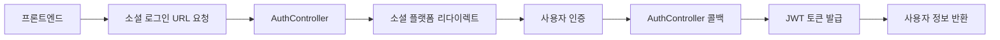

# 📡 Factory BE API 개요

> 소셜 로그인 기반 뉴스 분석 플랫폼의 RESTful API 아키텍처

## 🎯 현재 구현된 API 구조

### 1. 도메인 기반 API 설계
```
/api/v1/auth/*        # 소셜 로그인 인증 (Kakao, Google)
/api/v1/news/*        # 뉴스 관리 및 크롤링
/api/v1/analysis/*    # AI 분석 기능
/api/v1/search/*      # OpenSearch 기반 검색
/api/v1/dashboard/*   # 대시보드 데이터
/api/v1/users/*       # 사용자 관리 (소셜 계정만)
/api/v1/batch/*       # 배치 작업 제어 (관리자 전용)
```

### 2. 현재 구현된 주요 컨트롤러

#### 🔐 AuthController
- **위치**: `src/main/java/com/commonground/be/domain/auth/controller/AuthController.java`
- **기능**: JWT 기반 소셜 로그인 인증
- **주요 엔드포인트**:
  ```
  POST /api/v1/auth/reissue          # 토큰 갱신
  GET  /api/v1/auth/me               # 현재 사용자 정보
  POST /api/v1/auth/logout           # 로그아웃 (단일/전체 기기)
  POST /api/v1/auth/withdraw         # 회원 탈퇴
  GET  /api/v1/auth/kakao/logout-url # 카카오 로그아웃 URL
  ```

#### 📰 NewsController  
- **위치**: `src/main/java/com/commonground/be/domain/news/controller/NewsController.java`
- **기능**: 뉴스 CRUD 및 크롤링 제어
- **주요 엔드포인트**:
  ```
  GET    /api/v1/news               # 뉴스 목록 조회
  POST   /api/v1/news               # 뉴스 생성
  GET    /api/v1/news/{id}          # 뉴스 상세 조회
  PUT    /api/v1/news/{id}          # 뉴스 수정
  DELETE /api/v1/news/{id}          # 뉴스 삭제
  POST   /api/v1/news/crawl/naver   # 네이버 크롤링 시작
  POST   /api/v1/news/crawl/url     # URL 크롤링
  GET    /api/v1/news/recent        # 최신 뉴스
  GET    /api/v1/news/trending      # 급상승 뉴스
  ```

#### 🔍 SearchController
- **위치**: `src/main/java/com/commonground/be/domain/search/controller/SearchController.java`
- **기능**: OpenSearch 기반 고급 검색
- **주요 엔드포인트**:
  ```
  GET /api/v1/search/news               # 통합 뉴스 검색
  GET /api/v1/search/my-analyses        # 내 분석 검색
  GET /api/v1/search/popular            # 인기 검색어
  GET /api/v1/search/realtime-popular   # 실시간 검색어
  GET /api/v1/search/autocomplete       # 검색 자동완성
  GET /api/v1/search/statistics         # 검색 통계
  GET /api/v1/search/history            # 검색 히스토리
  ```

#### 🧠 AnalysisController
- **위치**: `src/main/java/com/commonground/be/domain/analysis/controller/AnalysisController.java`
- **기능**: AI 기반 뉴스 분석
- **주요 엔드포인트**:
  ```
  POST   /api/v1/analysis              # 분석 시작
  GET    /api/v1/analysis/{id}         # 분석 결과 조회
  GET    /api/v1/analysis/{id}/status  # 분석 상태 조회
  GET    /api/v1/analysis/my           # 내 분석 목록
  DELETE /api/v1/analysis/{id}         # 분석 취소
  POST   /api/v1/analysis/{id}/restart # 분석 재시작
  ```

#### 📊 DashboardController
- **위치**: `src/main/java/com/commonground/be/domain/dashboard/controller/DashboardController.java`
- **기능**: 대시보드 데이터 제공
- **주요 엔드포인트**:
  ```
  GET /api/v1/dashboard/main      # 메인 대시보드
  GET /api/v1/dashboard/user      # 사용자 대시보드
  GET /api/v1/dashboard/category  # 카테고리별 뉴스
  ```

#### 🔄 BatchController (NEW!)
- **위치**: `src/main/java/com/commonground/be/domain/news/controller/BatchController.java`
- **기능**: 정기 크롤링 배치 제어
- **주요 엔드포인트**:
  ```
  POST /api/v1/batch/naver/crawling/start  # 배치 수동 실행
  GET  /api/v1/batch/status                # 배치 상태 조회
  GET  /api/v1/batch/schedule              # 스케줄 설정 조회
  GET  /api/v1/batch/config                # 배치 설정 조회
  ```

## 🚀 정기 크롤링 배치 시스템 (NEW!)

### 배치 스케줄
- **정기 크롤링**: 매 2시간마다 (6-22시)
- **속보 크롤링**: 매 30분마다 (7-23시)  
- **새벽 크롤링**: 매일 새벽 3시
- **주간 종합**: 매주 일요일 오전 1시

### 크롤링 대상 언론사 (27개 설정)
```yaml
주요 일간지:
  - 경향신문, 동아일보, 조선일보, 중앙일보
  - 한겨레, 한국일보, 국민일보, 문화일보, 세계일보

경제 전문지:
  - 매일경제, 머니투데이, 조선비즈

방송사:
  - SBS, KBS, MBC, YTN, 뉴스1

카테고리별 수집:
  - 정치: 12개 언론사, 각 30개 기사
  - 경제: 7개 언론사, 각 25개 기사  
  - 사회: 5개 언론사, 각 20개 기사
```

## 📊 현재 구현된 Facade 패턴

### 1. AnalysisFacade
- **위치**: `src/main/java/com/commonground/be/domain/analysis/facade/AnalysisFacade.java`
- **책임**: 분석 요청 파이프라인 관리
- **주요 메서드**:
  ```java
  AnalysisFlowResult createAnalysisFlow(UserDetails, AnalysisStartRequest)
  AnalysisFlowResult getAnalysisFlow(UserDetails, String analysisId)
  AnalysisFlowResult getUserAnalysesFlow(UserDetails, int page, int size)
  AnalysisFlowResult deleteAnalysisFlow(UserDetails, String analysisId)
  AnalysisFlowResult restartAnalysisFlow(UserDetails, String analysisId)
  ```

### 2. AuthFacade
- **위치**: `src/main/java/com/commonground/be/domain/auth/facade/AuthFacade.java`
- **책임**: 인증 프로세스 조율
- **주요 메서드**:
  ```java
  AuthFlowResult socialLoginFlow(String provider, SocialLoginRequest)
  AuthFlowResult refreshTokenFlow(String refreshToken)
  AuthFlowResult logoutFlow(UserDetails, LogoutRequest)
  ```

### 3. SearchFacade
- **위치**: `src/main/java/com/commonground/be/domain/search/facade/SearchFacade.java`
- **책임**: 검색 요청 파이프라인 관리
- **주요 메서드**:
  ```java
  SearchFlowResult unifiedSearchFlow(SearchRequest)
  SearchFlowResult autocompleteFlow(String query, int limit)
  SearchFlowResult getSearchHistoryFlow(UserDetails, int page, int size)
  ```

### 4. DashboardFacade
- **위치**: `src/main/java/com/commonground/be/domain/dashboard/facade/DashboardFacade.java`
- **책임**: 대시보드 데이터 집계 관리
- **주요 메서드**:
  ```java
  DashboardFlowResult getMainDashboardFlow(int, int, int, int)
  DashboardFlowResult getUserDashboardFlow(UserDetails, int limit)
  ```

### 5. NewsFacade
- **위치**: `src/main/java/com/commonground/be/domain/news/facade/NewsFacade.java`
- **책임**: 뉴스 관리 및 크롤링 파이프라인
- **주요 메서드**:
  ```java
  NewsFlowResult naverCrawlingFlow(NaverCrawlingRequest)
  NewsFlowResult urlCrawlingFlow(UrlCrawlingRequest)
  NewsFlowResult getRecentNewsFlow(int limit)
  NewsFlowResult getTrendingNewsFlow(int limit)
  ```

## 🔧 핵심 서비스 계층

### 1. CrawlingOrchestrationService
- **위치**: `src/main/java/com/commonground/be/domain/news/service/crawling/CrawlingOrchestrationService.java`
- **책임**: Python 크롤러와의 통신 관리
- **주요 메서드**:
  ```java
  CompletableFuture<List<RawNewsData>> orchestrateCrawling(NaverCrawlingRequest)
  CompletableFuture<List<RawNewsData>> crawlNews(NaverCrawlingRequest)
  ```

### 2. OpenSearchIndexingService
- **위치**: `src/main/java/com/commonground/be/domain/news/service/search/OpenSearchIndexingService.java`
- **책임**: OpenSearch 인덱싱 및 검색
- **주요 메서드**:
  ```java
  CompletableFuture<Void> indexNews(News)
  SearchResult searchNews(String keyword, int page, int size)
  CompletableFuture<Void> deleteNews(String newsId)
  ```

### 3. AnalysisServiceImpl
- **위치**: `src/main/java/com/commonground/be/domain/analysis/service/AnalysisServiceImpl.java`
- **책임**: AI 분석 작업 관리
- **주요 메서드**:
  ```java
  AnalysisResponse startAnalysis(String userId, AnalysisStartRequest)
  AnalysisResultResponse getAnalysisResult(String userId, Long analysisId)
  MyAnalysesResponse getMyAnalyses(String userId, Pageable)
  ```

## 🔐 소셜 로그인 아키텍처

### 지원 플랫폼
- **Kakao**: OAuth 2.0 기반 인증
- **Google**: OAuth 2.0 기반 인증

### 인증 플로우

```mermaid
graph LR
    A[프론트엔드] --> B[소셜 로그인 URL 요청]
    B --> C[AuthController]
    C --> D[소셜 플랫폼 리다이렉트]
    D --> E[사용자 인증]
    E --> F[AuthController 콜백]
    F --> G[JWT 토큰 발급]
    G --> H[사용자 정보 반환]
```

### JWT 토큰 관리
- **Access Token**: 1시간 (보안 강화)
- **Refresh Token**: 14일 (장기간 로그인 유지)
- **쿠키 기반**: HttpOnly, Secure 쿠키로 Refresh Token 관리

## 🎯 API 응답 표준화

### 성공 응답
```json
{
  "success": true,
  "data": {
    // 실제 데이터
  },
  "meta": {
    "version": "v1.0",
    "timestamp": "2025-08-17T10:30:00Z"
  }
}
```

### 오류 응답
```json
{
  "success": false,
  "error": {
    "code": "INVALID_PARAMETER",
    "message": "잘못된 파라미터입니다",
    "details": {
      "field": "category",
      "value": "invalid",
      "reason": "유효하지 않은 카테고리"
    }
  },
  "timestamp": "2025-08-17T10:30:00Z"
}
```

## 🧪 테스트 환경

### HTTP 테스트 파일
```
tests/api/01_auth.http          # 인증 API 테스트
tests/api/02_news.http          # 뉴스 API 테스트  
tests/api/03_analysis.http      # 분석 API 테스트
tests/api/04_search.http        # 검색 API 테스트
tests/api/05_dashboard.http     # 대시보드 API 테스트
tests/api/06_batch.http         # 배치 API 테스트 (NEW!)
```

## 📈 성능 최적화

### OpenSearch 쿼리 최적화
- 가중치 기반 멀티필드 검색 (제목 3.0x, 키워드 2.5x)
- 한글 키워드 전처리 및 불용어 제거
- 퍼지 매칭으로 오타 허용
- 관련도 + 날짜 순 정렬

### Redis 캐싱 전략
- 검색 결과 캐싱 (10분)
- 대시보드 데이터 캐싱 (5분)
- 인기 검색어 캐싱 (1시간)

## 🔒 보안 및 권한

### 권한 체계
- **USER**: 일반 사용자 (뉴스 조회, 검색, 분석)
- **MANAGER**: 관리자 (배치 제어, 통계 조회)
- **ADMIN**: 최고 관리자 (전체 시스템 제어)

### API 보안
- JWT 토큰 검증
- `@PreAuthorize` 어노테이션 기반 권한 검사
- 입력 검증 (Bean Validation)
- SQL Injection 방지

---

**💡 참고**: 이 문서는 현재 구현된 코드를 기반으로 작성되었습니다. 실제 API 사용 시 [REST API 상세 명세서](rest-api.md)를 참조하세요.