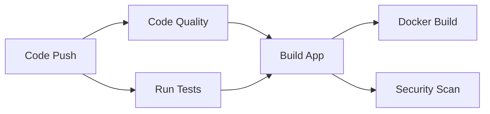
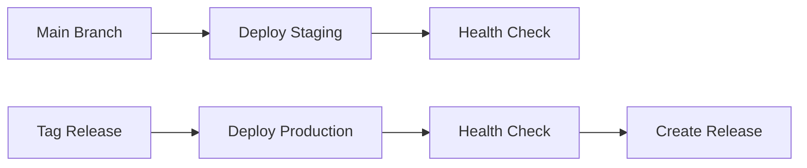

# 🚀 CommonGround BE GitHub Actions CI/CD 설정 가이드

## 개요
CommonGround 백엔드 프로젝트의 GitHub Actions를 통한 지속적 통합(CI) 및 지속적 배포(CD) 파이프라인 설정 가이드입니다.

## 📋 목차
- [파이프라인 구조](#파이프라인-구조)
- [필수 환경설정](#필수-환경설정)
- [CI 파이프라인](#ci-파이프라인)
- [CD 파이프라인](#cd-파이프라인)
- [모니터링 및 알림](#모니터링-및-알림)
- [트러블슈팅](#트러블슈팅)

## 🏗️ 파이프라인 구조

### CI 파이프라인 (`.github/workflows/ci.yml`)


### CD 파이프라인 (`.github/workflows/cd.yml`)


## ⚙️ 필수 환경설정

### 1. GitHub Secrets 설정

리포지토리 설정 → Secrets and variables → Actions에서 다음 시크릿들을 설정하세요:

#### 🔐 기본 인증 정보
```bash
# Docker Hub (선택사항)
DOCKER_USERNAME=your-dockerhub-username
DOCKER_PASSWORD=your-dockerhub-password

# GitHub Token (자동 생성됨)
GITHUB_TOKEN # 자동으로 사용 가능
```

#### ☁️ AWS 배포 설정 (운영환경)
```bash
# AWS 인증 정보
AWS_ACCESS_KEY_ID=AKIA...
AWS_SECRET_ACCESS_KEY=your-secret-key
AWS_REGION=ap-northeast-2

# ECS 클러스터 정보
ECS_CLUSTER_NAME=commonground-cluster
ECS_SERVICE_NAME=commonground-be-service
ECR_REPOSITORY=commonground/be
```

#### 🔔 알림 설정
```bash
# Slack 웹훅 (선택사항)
SLACK_WEBHOOK_URL=https://hooks.slack.com/services/...

# 헬스체크 URL
STAGING_HEALTH_CHECK_URL=https://staging-api.commonground.com
PRODUCTION_HEALTH_CHECK_URL=https://api.commonground.com
MONITORING_DASHBOARD_URL=https://monitoring.commonground.com
```

### 2. GitHub Environments 설정

Settings → Environments에서 환경 생성:

#### 🧪 Staging Environment
- **Environment name**: `staging`
- **Deployment branches**: `main` 브랜치만
- **Environment secrets**: 스테이징 전용 설정

#### 🚀 Production Environment
- **Environment name**: `production`  
- **Deployment branches**: 태그만 (`v*`)
- **Required reviewers**: 1명 이상 승인 필요
- **Wait timer**: 5분 대기 (선택사항)

### 3. Branch Protection Rules

Settings → Branches에서 `main` 브랜치 보호 규칙 설정:

```yaml
보호 규칙:
  - Require a pull request before merging
  - Require status checks to pass before merging
    ✅ code-quality
    ✅ test  
    ✅ build
  - Require branches to be up to date before merging
  - Require linear history
  - Include administrators
```

## 🔄 CI 파이프라인

### 트리거 조건
- `main`, `develop` 브랜치에 Push
- `main`, `develop` 브랜치로의 Pull Request

### 실행 단계

#### 1️⃣ Code Quality & Security
```yaml
실행 내용:
  - Checkstyle 코드 스타일 검사
  - SpotBugs 정적 분석
  - Trivy 보안 취약점 스캔
  - SonarQube 코드 품질 분석 (선택)

아티팩트:
  - code-quality-reports/
  - trivy-results.sarif
```

#### 2️⃣ Run Tests
```yaml
테스트 환경:
  - MySQL 8.0 서비스 컨테이너
  - Redis 7.0 서비스 컨테이너
  - JUnit 5 + Mockito 테스트 실행

실행 테스트:
  - 단위 테스트 (Unit Tests)
  - 통합 테스트 (Integration Tests)
  - 테스트 커버리지 측정 (JaCoCo)

아티팩트:
  - test-results/
  - jacoco-coverage-report/
```

#### 3️⃣ Build Application
```yaml
빌드 과정:
  - Gradle 의존성 캐싱
  - JAR 파일 생성
  - 빌드 아티팩트 업로드

최적화:
  - Gradle Build Cache 활용
  - 테스트 제외 빌드 (이미 실행됨)

아티팩트:
  - jar-artifact/
```

#### 4️⃣ Docker Build (메인 브랜치만)
```yaml
Docker 이미지:
  - Multi-stage 빌드
  - 태그: latest, branch-{sha}
  - 이미지 최적화 및 보안 강화

푸시 대상:
  - GitHub Container Registry (ghcr.io)
  - Docker Hub (선택사항)
```

### CI 실행 예시
```bash
# 로컬에서 CI 검증
# 1. 코드 품질 검사
./gradlew checkstyleMain spotbugsMain

# 2. 테스트 실행  
./gradlew test integrationTest

# 3. 빌드
./gradlew build

# 4. Docker 빌드 테스트
docker build -t commonground-be:test .
```

## 🚀 CD 파이프라인

### 배포 전략

#### 🧪 Staging 배포
```yaml
트리거:
  - main 브랜치 Push
  - 수동 트리거 (workflow_dispatch)

배포 과정:
  1. ECR에 이미지 푸시
  2. ECS 서비스 업데이트
  3. 배포 완료 대기 (5분)
  4. 헬스체크 실행
  5. Slack 알림
```

#### 🚀 Production 배포
```yaml
트리거:
  - 태그 Push (v*)
  - 수동 트리거 (승인 필요)

배포 과정:
  1. 현재 서비스 백업
  2. ECR에 이미지 푸시  
  3. ECS 서비스 업데이트
  4. 배포 완료 대기 (10분)
  5. 엄격한 헬스체크
  6. 실패시 자동 롤백
  7. GitHub Release 생성
  8. Slack 알림
```

### 배포 명령어

#### 스테이징 배포
```bash
# main 브랜치에 Push하면 자동 배포
git checkout main
git merge feature/new-feature
git push origin main

# 또는 수동 트리거
# GitHub → Actions → CD Pipeline → Run workflow
```

#### 프로덕션 배포
```bash
# 태그 생성 및 Push
git tag -a v1.2.3 -m \"Release v1.2.3\"
git push origin v1.2.3

# 또는 GitHub Release 생성
# GitHub → Releases → Create a new release
```

### 롤백 절차
```bash
# 자동 롤백 (실패시)
- CD 파이프라인이 헬스체크 실패시 자동으로 이전 버전으로 롤백

# 수동 롤백
1. AWS ECS 콘솔 접속
2. 서비스 → 업데이트 → 이전 태스크 정의 선택
3. 또는 AWS CLI 사용:
   aws ecs update-service --cluster production-cluster \
     --service commonground-be --task-definition previous-task-def
```

## 📊 모니터링 및 알림

### GitHub Actions 모니터링

#### 워크플로우 상태 확인
```bash
# GitHub CLI 사용
gh run list --workflow=ci.yml
gh run view <run-id>

# 웹 인터페이스
https://github.com/your-org/BE/actions
```

#### 실패 알림 설정
```yaml
Slack 알림:
  - 빌드 실패시 즉시 알림
  - 배포 성공/실패 알림
  - 보안 취약점 발견시 알림

이메일 알림:
  - GitHub 설정 → Notifications에서 활성화
  - Actions 실패시 자동 이메일 발송
```

### 성능 모니터링

#### 빌드 시간 최적화
```yaml
최적화 방법:
  - Gradle Build Cache 활용
  - Docker Layer Caching
  - 의존성 캐싱
  - 병렬 실행 활용

현재 평균 빌드 시간:
  - CI 파이프라인: ~8분
  - CD 스테이징: ~5분  
  - CD 프로덕션: ~7분
```

#### 리소스 사용량
```yaml
GitHub Actions 사용량:
  - Private 리포지토리: 월 2,000분 제한
  - 현재 예상 사용량: ~800분/월
  - 최적화 여지: 충분함
```

## 🐛 트러블슈팅

### 일반적인 문제

#### 1. 빌드 실패
```bash
# 로그 확인
gh run view <run-id> --log

# 로컬에서 재현
./gradlew clean build

# 의존성 문제
./gradlew dependencies --refresh-dependencies
```

#### 2. 테스트 실패
```bash
# 테스트 로그 확인
./gradlew test --info

# 특정 테스트만 실행
./gradlew test --tests \"*UserServiceTest*\"

# 통합 테스트 데이터베이스 확인
docker-compose up mysql redis
```

#### 3. Docker 빌드 실패
```bash
# 로컬 Docker 빌드 테스트
docker build -t test .

# 멀티스테이지 빌드 단계별 확인
docker build --target build -t test-build .
docker build --target runtime -t test-runtime .

# 빌드 로그 상세 확인
docker build --no-cache --progress=plain .
```

#### 4. 배포 실패
```bash
# ECS 서비스 상태 확인
aws ecs describe-services --cluster production-cluster \
  --services commonground-be

# 헬스체크 직접 실행
curl -f https://api.commonground.com/actuator/health

# 로그 확인
aws logs get-log-events --log-group-name /ecs/commonground-be
```

### Secrets 문제

#### 누락된 Secrets 확인
```bash
# GitHub CLI로 확인
gh secret list

# 필수 Secrets 체크리스트
✅ AWS_ACCESS_KEY_ID
✅ AWS_SECRET_ACCESS_KEY  
✅ AWS_REGION
✅ SLACK_WEBHOOK_URL
✅ STAGING_HEALTH_CHECK_URL
✅ PRODUCTION_HEALTH_CHECK_URL
```

#### 환경변수 디버깅
```yaml
# workflow에 임시 디버그 스텝 추가
- name: Debug Environment
  run: |
    echo \"AWS Region: $AWS_REGION\"
    echo \"Secrets available: $(env | grep -E '^[A-Z_]+=' | wc -l)\"
  env:
    AWS_REGION: ${{ secrets.AWS_REGION }}
```

### 성능 최적화

#### 캐시 최적화
```yaml
# Gradle 캐시 키 개선
key: ${{ runner.os }}-gradle-${{ hashFiles('**/*.gradle*', '**/gradle-wrapper.properties') }}

# Docker 캐시 활용
- name: Set up Docker Buildx
  uses: docker/setup-buildx-action@v2
  with:
    buildkitd-flags: --debug
```

#### 병렬 실행 최적화
```yaml
# 의존성 최적화
needs: [code-quality, test]  # 병렬 실행
# vs
needs: code-quality          # 순차 실행
needs: test
```

## 📈 고급 설정

### 조건부 실행
```yaml
# 특정 파일 변경시만 실행
- name: Run tests
  if: contains(github.event.head_commit.modified, 'src/')
  
# 브랜치별 조건
- name: Deploy to production  
  if: startsWith(github.ref, 'refs/tags/v')
```

### 매트릭스 빌드
```yaml
strategy:
  matrix:
    java-version: [17, 21]
    os: [ubuntu-latest, windows-latest]
```

### 커스텀 액션 생성
```yaml
# .github/actions/setup-gradle/action.yml
name: 'Setup Gradle'
description: 'Setup Java and Gradle with caching'
runs:
  using: 'composite'
  steps:
    - uses: actions/setup-java@v3
      with:
        java-version: '17'
        distribution: 'temurin'
    - uses: actions/cache@v3
      with:
        path: ~/.gradle/caches
        key: gradle-${{ hashFiles('**/*.gradle*') }}
```

## 📞 지원 및 문의

### 도움말 리소스
- [GitHub Actions 문서](https://docs.github.com/en/actions)
- [Docker 공식 가이드](https://docs.docker.com/)
- [AWS ECS 문서](https://docs.aws.amazon.com/ecs/)

### 문제 보고
CI/CD 관련 문제 발생시 다음 정보와 함께 이슈를 등록해주세요:

1. **워크플로우 정보**
   - Run ID 및 URL
   - 실패한 스텝 이름
   - 에러 메시지

2. **환경 정보**
   - 브랜치명
   - 커밋 SHA
   - 트리거 이벤트

3. **재현 단계**
   - 로컬 실행 결과
   - 관련 로그 파일

---

> 💡 **팁**: 배포 전에는 항상 스테이징 환경에서 충분히 테스트하고, 프로덕션 배포는 업무시간 외에 수행하는 것을 권장합니다.