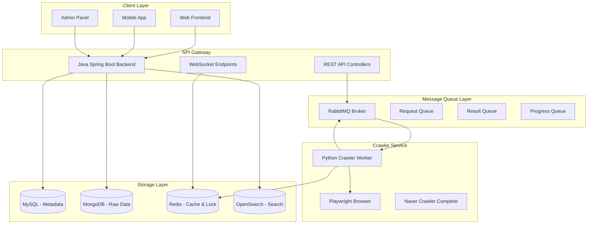

# 🚀 Java-Python 하이브리드 시스템 가이드

> Factory BE의 Java Backend + Python Crawler 하이브리드 아키텍처 완전 가이드

## 📋 목차

- [시스템 개요](#-시스템-개요)
- [아키텍처 구조](#%EF%B8%8F-아키텍처-구조)
- [통신 프로토콜](#-통신-프로토콜)
- [동시성 제어](#-동시성-제어)
- [개발 가이드](#-개발-가이드)
- [배포 및 운영](#-배포-및-운영)
- [모니터링](#-모니터링)

## 🎯 시스템 개요

Factory BE는 **Java Spring Boot**와 **Python**의 장점을 결합한 하이브리드 크롤링 시스템입니다.

### 🔄 역할 분담

| 컴포넌트 | 기술스택 | 주요 역할 |
|----------|----------|-----------|
| **Backend API** | Java Spring Boot | 비즈니스 로직, 데이터 관리, 사용자 API |
| **Crawler Service** | Python + AsyncIO | 웹 크롤링, 데이터 수집 |
| **Message Queue** | RabbitMQ | Java-Python 간 비동기 통신 |
| **Distributed Lock** | Redis | 동시성 제어, 중복 방지 |
| **Progress Tracking** | WebSocket + Redis | 실시간 진행상황 추적 |

### ✨ 하이브리드 시스템의 장점

1. **성능 최적화**: Java는 안정적인 API 서비스, Python은 빠른 크롤링
2. **확장성**: 언어별 특화된 라이브러리 활용 (Spring Security, Playwright)
3. **유지보수성**: 관심사 분리로 독립적인 개발 및 배포
4. **안정성**: 장애 격리 - 크롤러 문제가 API 서비스에 영향 없음

## 🏗️ 아키텍처 구조



## 📡 통신 프로토콜

### 🔄 메시지 플로우

```
1. [Frontend] → [Java API] : 크롤링 요청
2. [Java API] → [RabbitMQ] : 크롤링 메시지 발행
3. [RabbitMQ] → [Python]  : 메시지 소비 및 처리
4. [Python]   → [Redis]   : 분산 락 획득
5. [Python]   → [Browser] : 실제 웹 크롤링
6. [Python]   → [RabbitMQ]: 진행상황 업데이트
7. [Python]   → [RabbitMQ]: 결과 데이터 전송
8. [RabbitMQ] → [Java API]: 결과 수신 및 저장
9. [Java API] → [Frontend]: WebSocket으로 실시간 업데이트
```

### 📨 메시지 포맷

#### 크롤링 요청 메시지 (Java → Python)

```json
{
  "requestId": "crawl_req_001",
  "requestType": "NAVER_CRAWLING",
  "payload": {
    "sessionId": "session_123",
    "officeId": "001",         // 연합뉴스
    "categoryId": "100",       // 정치
    "maxArticles": 50,
    "maxScrollAttempts": 10,
    "includeContent": true
  },
  "timestamp": 1692000000000
}
```

#### 크롤링 결과 메시지 (Python → Java)

```json
{
  "requestId": "crawl_req_001",
  "success": true,
  "data": [
    {
      "title": "정치 뉴스 제목",
      "content": "뉴스 본문 내용...",
      "url": "https://n.news.naver.com/article/001/123456",
      "authorName": "김기자",
      "publishedAt": "2024-08-13T10:00:00",
      "officeId": "001",
      "categoryId": "100",
      "articleId": "123456",
      "discoveredAt": "2024-08-13T10:05:00Z",
      "responseTime": 1500,
      "source": "python_crawler",
      "metadata": {
        "mediaName": "연합뉴스"
      }
    }
  ],
  "errorMessage": null,
  "timestamp": 1692000060000
}
```

#### 진행상황 메시지 (Python → Java)

```json
{
  "sessionId": "session_123",
  "status": "crawling_articles",
  "progress": 65,
  "message": "기사 크롤링 중... (32/50)",
  "totalArticles": 50,
  "processedArticles": 32,
  "successCount": 28,
  "failCount": 4
}
```

## 🔒 동시성 제어

### Redis 분산 락 시스템

같은 언론사/카테고리에 대한 중복 크롤링을 방지하기 위해 Redis 기반 분산 락을 사용합니다.

#### Java 측 분산 락

```java
@RedisLock(
    key = "'naver_crawling:' + #request.officeId + ':' + #request.categoryId",
    waitTime = 5,
    leaseTime = 300,  // 5분 - 크롤링 작업이 길 수 있음
    timeoutMessage = "해당 언론사의 크롤링이 이미 진행 중입니다."
)
public CompletableFuture<List<RawNewsData>> crawlNews(NaverCrawlingRequest request) {
    // 크롤링 로직
}
```

#### Python 측 분산 락

```python
@redis_lock(
    key_template="naver_crawling:{request.office_id}:{request.category_id}",
    wait_time=5.0,
    lease_time=300.0,
    timeout_message="해당 언론사의 크롤링이 이미 진행 중입니다."
)
async def crawl_news(self, request: NaverCrawlingRequest):
    # 크롤링 로직
```

### 락 키 정책

| 락 키 패턴 | 설명 | 예시 |
|------------|------|------|
| `naver_crawling:{officeId}:{categoryId}` | 언론사별 카테고리별 락 | `naver_crawling:001:100` |
| `crawling_progress:{sessionId}` | 진행상황 캐시 | `crawling_progress:session_123` |

## 💻 개발 가이드

### 개발 환경 설정

#### 1. Docker 인프라 시작

```bash
# RabbitMQ, Redis, MongoDB, MySQL 등 시작
docker-compose -f docker-compose.dev.yml up -d

# 서비스 상태 확인
docker-compose -f docker-compose.dev.yml ps
```

#### 2. Java Backend 실행

```bash
# Gradle로 실행
./gradlew bootRun --args='--spring.profiles.active=dev'

# IDE에서 실행 시 VM Options
-Dspring.profiles.active=dev
```

#### 3. Python Crawler Worker 실행

```bash
cd python_crawler_advanced

# 의존성 설치 (최초 한번)
pip install -r requirements.txt
playwright install chromium

# 워커 실행
python enhanced_crawler_worker.py
```

### 새로운 크롤링 소스 추가

#### Java 측 코드

```java
// 1. DTO 확장
public class CustomCrawlingRequest extends CrawlingRequestMessage {
    private String customField;
    // getters, setters
}

// 2. 큐 서비스에 메서드 추가
@Service
public class CrawlingQueueService {
    
    public CompletableFuture<List<RawNewsData>> submitCustomCrawling(CustomCrawlingRequest request) {
        CrawlingRequestMessage message = CrawlingRequestMessage.builder()
            .requestId(UUID.randomUUID().toString())
            .requestType("CUSTOM_CRAWLING")
            .payload(request)
            .build();
            
        rabbitTemplate.convertAndSend(CRAWLING_EXCHANGE, REQUEST_ROUTING_KEY, message);
        return registerPendingRequest(message.getRequestId());
    }
}
```

#### Python 측 코드

```python
# 새로운 크롤러 클래스 추가
class CustomNewsCrawler:
    """커스텀 뉴스 소스 크롤러"""
    
    @redis_lock(
        key_template="custom_crawling:{request.source_id}",
        wait_time=5.0,
        lease_time=300.0
    )
    async def crawl_custom_news(self, request):
        # 크롤링 로직 구현
        pass

# 메시지 핸들러에 추가
async def handle_crawling_request(self, message_body: bytes):
    message_data = json.loads(message_body.decode())
    request_msg = CrawlingRequestMessage(**message_data)
    
    if request_msg.request_type == "CUSTOM_CRAWLING":
        # 커스텀 크롤러 처리
        crawler = CustomNewsCrawler()
        results = await crawler.crawl_custom_news(request_msg.payload)
    # 기존 로직...
```

## 🚀 배포 및 운영

### Docker 기반 배포

#### docker-compose.prod.yml

```yaml
version: '3.8'

services:
  java-backend:
    build: .
    environment:
      - SPRING_PROFILES_ACTIVE=prod
      - RABBITMQ_HOST=rabbitmq
      - REDIS_HOST=redis
    depends_on:
      - rabbitmq
      - redis
      - mysql
      - mongodb

  python-crawler:
    build: ./python_crawler_advanced
    environment:
      - RABBITMQ_URL=amqp://rabbitmq:5672
      - REDIS_URL=redis://redis:6379
    depends_on:
      - rabbitmq
      - redis
    deploy:
      replicas: 3  # 확장성을 위한 다중 인스턴스

  rabbitmq:
    image: rabbitmq:3.12-management
    environment:
      - RABBITMQ_DEFAULT_USER=admin
      - RABBITMQ_DEFAULT_PASS=secure_password
    
  redis:
    image: redis:7.0-alpine
    command: redis-server --requirepass secure_redis_pass
    
  # 기타 서비스...
```

### 확장 전략

#### Horizontal Scaling

1. **Python Crawler Worker**: 
   - 여러 인스턴스로 확장 가능
   - RabbitMQ의 라운드 로빈으로 부하 분산

2. **Java Backend**: 
   - 로드 밸런서 뒤에 여러 인스턴스 배치
   - Redis 세션으로 상태 공유

#### Vertical Scaling

1. **메모리 할당**:
   - Java Backend: 2-4GB
   - Python Crawler: 1-2GB per instance
   - Playwright: 추가 500MB per browser

2. **CPU 할당**:
   - CPU 집약적 작업은 Python 크롤러
   - I/O 집약적 작업은 Java 백엔드

## 📊 모니터링

### 핵심 메트릭

#### 시스템 메트릭

```yaml
# Prometheus + Grafana 설정
java_backend:
  - api_response_time
  - active_sessions
  - database_connection_pool
  - memory_usage

python_crawler:
  - crawling_success_rate
  - average_crawling_time
  - concurrent_browser_instances
  - memory_per_worker

message_queue:
  - queue_depth
  - message_processing_rate
  - connection_count
  - message_durability

redis_locks:
  - active_locks_count
  - lock_wait_time
  - lock_acquisition_rate
  - expired_locks
```

#### 비즈니스 메트릭

```yaml
crawling_performance:
  - articles_per_minute
  - success_rate_by_media
  - duplicate_detection_rate
  - content_quality_score

user_engagement:
  - api_calls_per_user
  - popular_search_terms
  - real_time_session_count
```

### 알림 정책

#### Critical Alerts (즉시 알림)

```yaml
- name: "Crawler Service Down"
  condition: python_crawler_instances == 0
  severity: critical

- name: "Message Queue Overflow"
  condition: rabbitmq_queue_depth > 10000
  severity: critical

- name: "Database Connection Failure"
  condition: mysql_connection_errors > 50
  severity: critical
```

#### Warning Alerts (5분 지연)

```yaml
- name: "High Crawling Failure Rate"
  condition: crawling_success_rate < 80%
  severity: warning

- name: "Redis Lock Timeout"
  condition: redis_lock_timeouts > 10/min
  severity: warning
```

### 로그 관리

#### 구조화된 로깅

```json
// Java Backend 로그 형식
{
  "timestamp": "2024-08-13T10:00:00Z",
  "level": "INFO",
  "service": "java-backend",
  "traceId": "trace-123",
  "message": "Crawling request submitted",
  "metadata": {
    "requestId": "crawl_req_001",
    "officeId": "001",
    "categoryId": "100"
  }
}

// Python Crawler 로그 형식
{
  "timestamp": "2024-08-13T10:00:30Z",
  "level": "INFO", 
  "service": "python-crawler",
  "traceId": "trace-123",
  "message": "Article crawling completed",
  "metadata": {
    "sessionId": "session_123",
    "articlesCount": 25,
    "successRate": 0.92
  }
}
```

### 헬스체크 엔드포인트

#### Java Backend

```http
GET /actuator/health
{
  "status": "UP",
  "components": {
    "rabbitmq": {"status": "UP"},
    "redis": {"status": "UP"}, 
    "mysql": {"status": "UP"},
    "mongodb": {"status": "UP"}
  }
}
```

#### Python Crawler

```http
GET /health
{
  "status": "healthy",
  "uptime": "2h 30m 15s",
  "active_crawlers": 3,
  "processed_requests": 1247,
  "success_rate": 0.94
}
```

## 🔧 문제 해결 가이드

### 일반적인 문제들

#### 1. RabbitMQ 연결 문제

```bash
# 연결 상태 확인
docker exec factory-rabbitmq-dev rabbitmqctl status

# 큐 상태 확인
docker exec factory-rabbitmq-dev rabbitmqctl list_queues

# 연결 재설정
docker-compose -f docker-compose.dev.yml restart rabbitmq
```

#### 2. Redis 분산 락 문제

```bash
# 활성 락 확인
docker exec factory-redis-dev redis-cli KEYS "naver_crawling:*"

# 특정 락 삭제 (주의: 수동으로만)
docker exec factory-redis-dev redis-cli DEL "naver_crawling:001:100"

# 락 TTL 확인
docker exec factory-redis-dev redis-cli TTL "naver_crawling:001:100"
```

#### 3. Python 크롤러 메모리 부족

```python
# 브라우저 인스턴스 제한
browser = await playwright.chromium.launch(
    args=[
        "--memory-pressure-off",
        "--max_old_space_size=1024",
        "--disable-dev-shm-usage"
    ]
)

# 주기적 GC 실행
import gc
gc.collect()
```

---

> 💡 **참고**: 이 하이브리드 시스템은 각 언어의 장점을 극대화하면서도 안정적인 통신과 동시성 제어를 보장합니다. 문제가 발생하면 각 컴포넌트를 독립적으로 진단하고 해결할 수 있습니다.