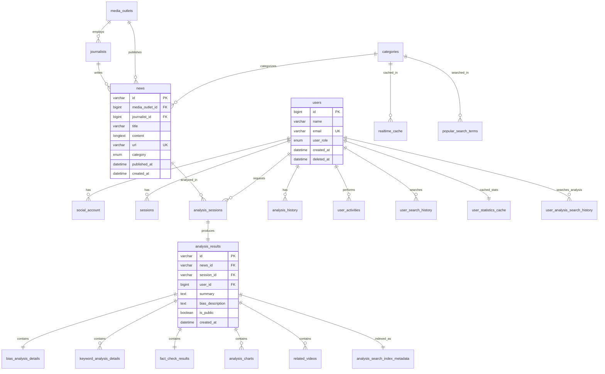
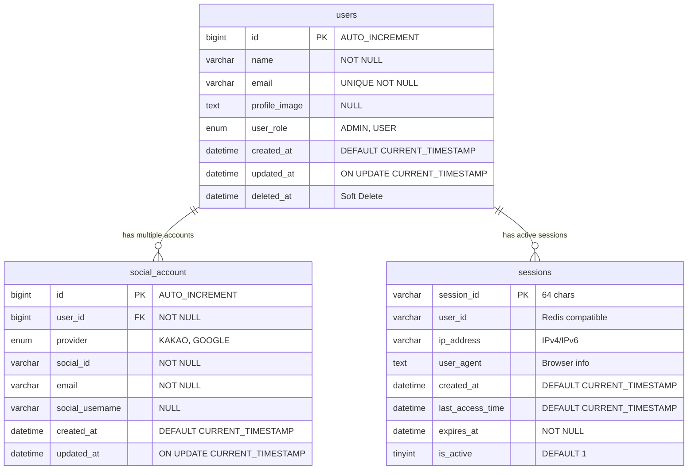
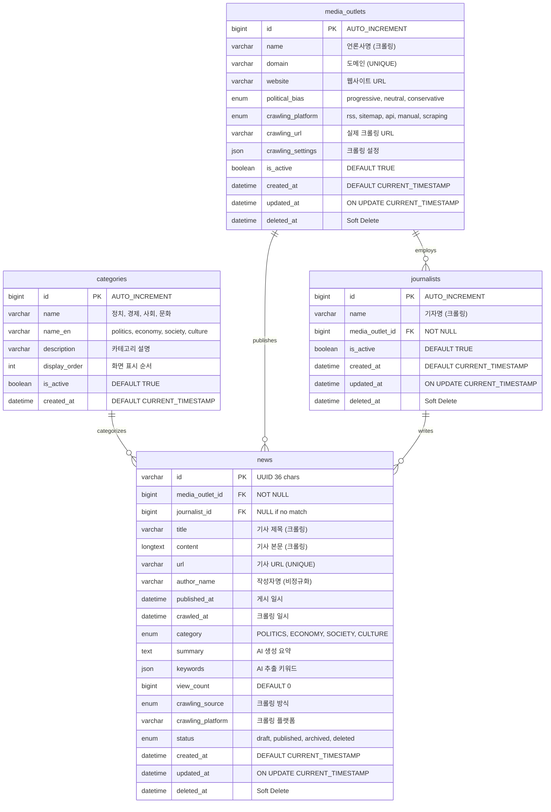
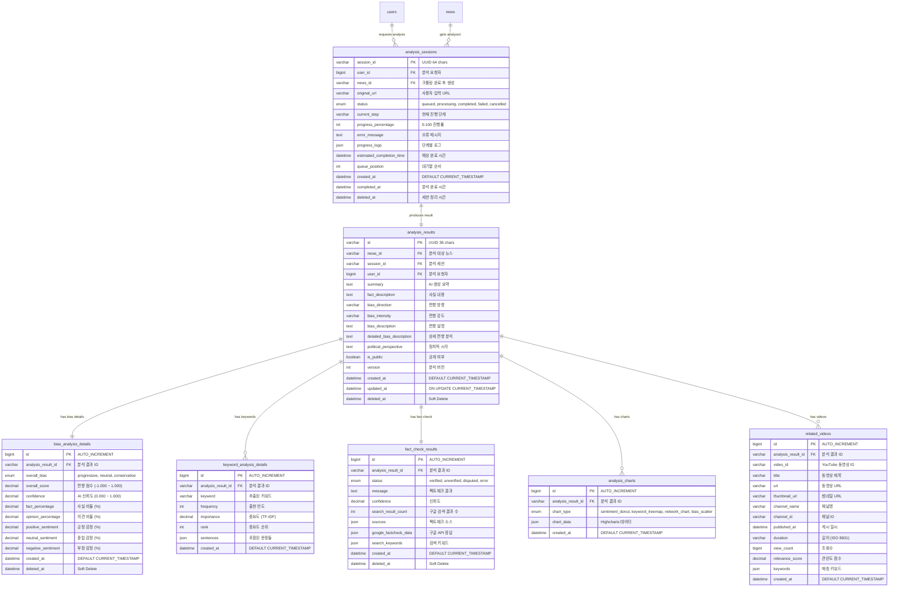
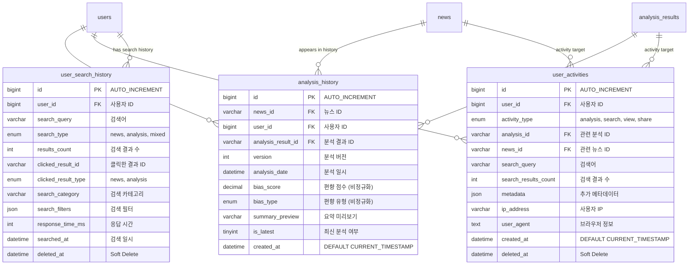
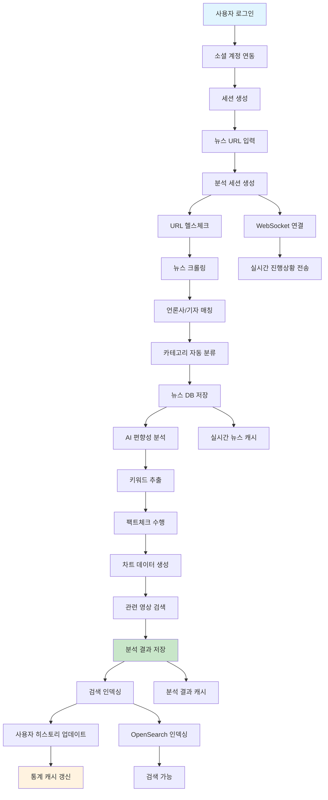

# 🗺️ Factory BE ERD 다이어그램 (Mermaid 코드)

## 📊 **전체 ERD (간략 버전)**

---

## 👤 **사용자 관리 ERD**

---

## 📰 **뉴스 컨텐츠 ERD**

---

## 🤖 **AI 분석 ERD**

---

## 📊 **사용자 활동 ERD**

---

## ⚡ **캐시 및 검색 ERD**

```mermaid
erDiagram
    categories ||--o{ realtime_cache : "cached by category"
    users ||--|| user_statistics_cache : "has cached stats"
    users ||--o{ user_analysis_search_history : "searches own analysis"
    analysis_results ||--|| analysis_search_index_metadata : "indexed for search"
    categories ||--o{ popular_search_terms : "searched within category"
    users ||--o{ user_analysis_history : "has analysis summary"
    
    realtime_cache {
        bigint id PK "AUTO_INCREMENT"
        enum cache_type "realtime, trending, popular, category"
        bigint category_id FK "카테고리별 캐시"
        json news_list "뉴스 목록 JSON"
        json statistics "통계 정보"
        datetime updated_at "캐시 갱신 시간"
        datetime expires_at "캐시 만료 시간"
    }
    
    user_statistics_cache {
        bigint id PK "AUTO_INCREMENT"
        bigint user_id FK "사용자 ID (UNIQUE)"
        bigint total_analyses "총 분석 횟수"
        datetime last_analysis_date "마지막 분석 일자"
        json bias_statistics "편향성 통계"
        json category_preferences "선호 카테고리"
        json media_outlet_preferences "선호 언론사"
        json recent_activities "최근 활동 10개"
        datetime cache_updated_at "1시간마다 갱신"
        datetime deleted_at "Soft Delete"
    }
    
    user_analysis_search_history {
        bigint id PK "AUTO_INCREMENT"
        bigint user_id FK "사용자 ID"
        varchar search_query "검색어 (내 분석)"
        enum search_engine "elasticsearch, opensearch"
        int results_count "검색 결과 수"
        varchar clicked_analysis_id "클릭한 분석 ID"
        json search_filters "검색 필터"
        json elasticsearch_query "실제 쿼리 (디버깅)"
        int response_time_ms "응답 시간"
        bigint total_hits "총 검색 결과"
        datetime searched_at "검색 일시"
        datetime deleted_at "Soft Delete"
    }
    
    analysis_search_index_metadata {
        bigint id PK "AUTO_INCREMENT"
        varchar analysis_result_id FK "분석 결과 ID"
        bigint user_id FK "분석 소유자 ID"
        varchar elasticsearch_index "OpenSearch 인덱스명"
        varchar document_id "OpenSearch 문서 ID"
        json indexed_fields "인덱싱 필드 정보"
        decimal search_boost_score "검색 부스트 점수"
        enum index_status "pending, indexed, failed, deleted"
        datetime last_indexed_at "마지막 인덱싱 시간"
        int index_version "인덱스 버전"
        text error_message "인덱싱 에러 메시지"
        datetime created_at "DEFAULT CURRENT_TIMESTAMP"
        datetime updated_at "ON UPDATE CURRENT_TIMESTAMP"
        datetime deleted_at "Soft Delete"
    }
    
    popular_search_terms {
        bigint id PK "AUTO_INCREMENT"
        varchar search_term "검색어"
        bigint search_count "검색 횟수 누적"
        bigint category_id FK "카테고리 ID (NULL이면 전체)"
        decimal trend_score "트렌드 점수"
        datetime last_searched_at "마지막 검색 시간"
        datetime created_at "DEFAULT CURRENT_TIMESTAMP"
        datetime updated_at "ON UPDATE CURRENT_TIMESTAMP"
    }
    
    user_analysis_history {
        bigint id PK "AUTO_INCREMENT"
        bigint user_id FK "사용자 ID"
        varchar session_id FK "분석 세션 ID"
        varchar news_title "뉴스 제목 (비정규화)"
        enum bias_type "편향 유형"
        decimal bias_score "편향 점수"
        varchar summary_preview "요약 미리보기"
        enum category "POLITICS, ECONOMY, SOCIETY, CULTURE"
        bigint media_outlet_id FK "언론사 ID"
        datetime analyzed_at "분석 일시"
    }
```

---

## 🔄 **데이터 플로우 다이어그램**

---

## 🎯 **주요 관계 요약**

### **1:1 관계**
- `analysis_sessions` ↔ `analysis_results`
- `analysis_results` ↔ `bias_analysis_details`
- `analysis_results` ↔ `fact_check_results`
- `users` ↔ `user_statistics_cache`
- `analysis_results` ↔ `analysis_search_index_metadata`

### **1:N 관계**
- `users` → `social_account`, `sessions`, `analysis_sessions`, `user_activities`
- `media_outlets` → `journalists`, `news`
- `categories` → `news`, `realtime_cache`, `popular_search_terms`
- `analysis_results` → `keyword_analysis_details`, `analysis_charts`, `related_videos`

### **N:M 관계 (중간 테이블로 해결)**
- 사용자 ↔ 뉴스 (analysis_history)
- 사용자 ↔ 분석 결과 (user_activities)
- 검색어 ↔ 카테고리 (popular_search_terms)

이 ERD 다이어그램들을 머메이드 라이브 에디터나 지원하는 도구에 복사해서 사용하실 수 있습니다! 🎯